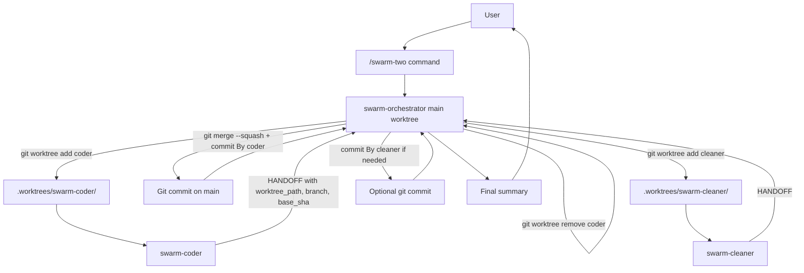

# Architecture

OpenCode Swarm Pack adapts SwarmForge concepts to OpenCode without copying the tmux daemon model.

## Mapping From SwarmForge

| SwarmForge | OpenCode Swarm Pack |
|---|---|
| `swarmforge.conf` | OpenCode command files |
| `roles/*.prompt` | OpenCode agent files |
| constitution articles | shared OpenCode skill |
| file handoff helpers | structured handoff text |
| daemon-driven tmux wakeups | orchestrator-controlled delegation |
| role worktrees | per-role worktrees since Phase 6 (one shared worktree before) |

## First Phase

Phase 1 through 5 intentionally avoids background daemons and uses a single shared worktree. Phase 6 introduces per-role worktrees while preserving the orchestrator-owned commit contract.

The orchestration model is:

```text
user -> swarm command -> orchestrator -> worktree add -> subagent -> handoff -> orchestrator -> squash-merge -> worktree remove -> next role
```

## Why A Command And Not Only Agents

OpenCode agents define behavior. OpenCode commands define entrypoints.

`/swarm-two` is not the team itself. It is the user-facing shortcut that starts the workflow with the right orchestrator and pack instructions.

The command invokes `swarm-orchestrator`. The orchestrator then delegates to `swarm-coder` and `swarm-cleaner`.

Without a command, the user would need to manually select or prompt the orchestrator every time and remember the exact workflow rules. The command makes the workflow repeatable:

- It selects the correct primary agent.
- It passes the user's request into the pack template.
- It fixes the intended flow: `coder -> cleaner -> final`.
- It keeps the invocation short: `/swarm-two <task>`.

The agents remain the actual workers. The command is only the front door.

## Two-Pack Flow Diagram

```text
┌────────────┐
│   User     │
└─────┬──────┘
      │ /swarm-two <task>
      ▼
┌────────────────────┐
│ swarm-two command  │
│ entrypoint only    │
└─────┬──────────────┘
      │ starts selected agent
      ▼
┌────────────────────┐
│ swarm-orchestrator │
│ main worktree      │
└─────┬──────────────┘
      │ git worktree add (coder)
      ▼
┌────────────────────────────────────┐
│ .worktrees/swarm-coder/<task-id>   │
│   ┌────────────────────┐           │
│   │ swarm-coder        │           │
│   │ edits + verifies   │           │
│   └─────┬──────────────┘           │
└─────────┼──────────────────────────┘
          │ HANDOFF (with worktree_path, branch, base_sha)
          ▼
┌────────────────────┐
│ swarm-orchestrator │
│ git merge --squash  │
│ git commit By coder │
│ git worktree remove│
└─────┬──────────────┘
      │ git worktree add (cleaner)
      ▼
┌────────────────────────────────────┐
│ .worktrees/swarm-cleaner/<task-id> │
│   ┌────────────────────┐           │
│   │ swarm-cleaner      │           │
│   │ cleanup + verifies │           │
│   └─────┬──────────────┘           │
└─────────┼──────────────────────────┘
          │ HANDOFF
          ▼
┌────────────────────┐
│ swarm-orchestrator │
│ commit By cleaner  │
│ if needed          │
└─────┬──────────────┘
      │ summary
      ▼
┌────────────┐
│   User     │
└────────────┘
```

## Mermaid Diagram



## Adversaries Flow Diagram

```text
┌────────────┐
│   User     │
└─────┬──────┘
      │ /swarm-adversaries <task>
      ▼
┌──────────────────────────┐
│ swarm-adversaries command│
│ entrypoint only          │
└─────┬────────────────────┘
      ▼
┌────────────────────┐
│ swarm-orchestrator │
│ main worktree      │
└─────┬──────────────┘
      │ git worktree add (coder)
      ▼
┌────────────────────────────────────┐
│ .worktrees/swarm-coder/<task-id>   │
│   ┌────────────────────┐           │
│   │ swarm-coder        │           │
│   └─────┬──────────────┘           │
└─────────┼──────────────────────────┘
          │ HANDOFF
          ▼
┌────────────────────┐
│ swarm-orchestrator │
│ inspect + commit   │
│ worktree remove    │
└─────┬──────────────┘
      │ git worktree add (reviewer)
      ▼
┌────────────────────────────────────┐
│ .worktrees/swarm-reviewer/<id>     │
│   ┌────────────────────┐           │
│   │ swarm-reviewer     │           │
│   │ no edits allowed   │           │
│   └─────┬──────────────┘           │
└─────────┼──────────────────────────┘
          │ HANDOFF with decision
          ▼
┌────────────────────┐
│ swarm-orchestrator │
└─────┬──────────────┘
      ├─ approved ───────────► final summary
      │
      └─ changes-requested ─► new coder worktree -> focused fix
```

The orchestrator is responsible for:

- Talking to the user.
- Selecting the workflow steps.
- Delegating to role agents.
- Inspecting changes after each role.
- Running or requesting verification.
- Creating small role-owned commits.
- Stopping on blockers or unsafe state.

Subagents are responsible for:

- Performing only their role-owned work.
- Keeping scope narrow.
- Verifying their changes when possible.
- Returning a structured handoff.
- Not committing.
- Not talking directly to the user.

## Commit Ownership

Only the orchestrator creates commits. This keeps history clean and prevents subagents from committing unexpected changes or user-owned work.

## Future Worktrees

Per-role worktrees are shipped in Phase 6. See `docs/worktree-discipline.md` for the full spec: layout, naming, merge strategy, dirty detection, conflict detection, opt-out, concurrent session safety, and recovery.

Earlier phases used one shared worktree sequentially. Phase 6 keeps the orchestrator-owned commit contract intact and adds isolation for subagent edits.
